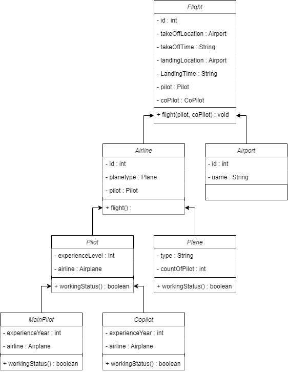

# Plane Management System

---

## In this assignment, we design a system to manage airplanes and pilots.

- Airlines operate the flights. Every airline has an identity.
- Airlines have different type of planes.
- Planes may be in operation or in a state of repair.
- Each plane has a unique identity, airport to take off and land, departure and landing times.
- Every flight has a pilot and a co-pilot.
- Airports have unique IDs and names.
- Airlines have pilots and each pilot has an experience level.
- A type of plane may need a certain number of pilots.

---

