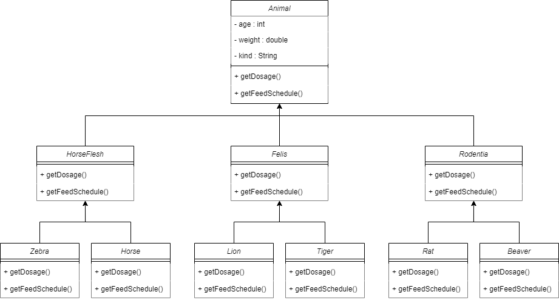

# Zoo Management System

---

### In this assignment we design a system for tracking information about animals in a zoo.

- Animals : Super Class
  - Horseflesh
  - Felis 
  - Rodentia
  

- Most of the information stored about animals is the same for all groupings.
- The system should also be able to get the dosage of specific drugs for each animal => getDosage()
- System should be able to calculate feed times => getFeedSchedule()
- The logic for the system to perform these functions will be different for each grouping.

- Using the polymorphism model, design a class diagram to handle the situation described above.

